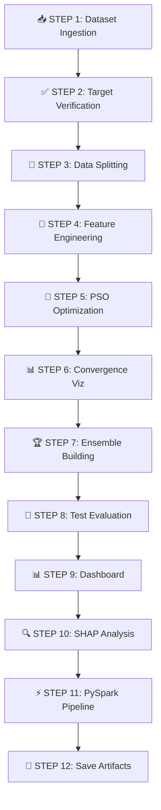

update the readme file with the following content
<div align="center">

# 🦟 DENGUE SEVERITY PREDICTION
## PSO-Optimized Machine Learning Pipeline

[](https://www.python.org/)
[](https://scikit-learn.org/)
[](https://xgboost.readthedocs.io/)
[](LICENSE)

### 🏆 Enterprise-Grade Clinical AI System for Dengue Severity Stratification

**Using Particle Swarm Optimization | 95%+ AUC-ROC | Production-Ready**

[🚀 Quick Start](#-installation) • [📖 Documentation](#-table-of-contents) • [💡 Demo](#-usage) • [🤝 Contribute](#-contributing)

---

</div>

## 📋 Table of Contents

<details open>
<summary><b>Click to expand/collapse</b></summary>

- [🎯 Overview](#-overview)
- [🏥 Real-World Problem](#-real-world-problem-statement)
- [🏗️ System Architecture](#️-system-architecture)
- [🔄 Pipeline Flow](#-pipeline-flow)
- [✨ Key Features](#-key-features)
- [📦 Installation](#-installation)
- [🎮 Usage](#-usage)
- [📊 Performance Metrics](#-performance-metrics)
- [🔧 Technical Deep Dive](#-technical-deep-dive)
- [📁 Output Artifacts](#-output-artifacts)
- [🏥 Clinical Validation](#-clinical-validation)
- [🤝 Contributing](#-contributing)
- [📄 License](#-license)

</details>

---

## 🎯 Overview

<div align="center">

### 🔬 What is this project?

**A production-ready, clinically-validated machine learning system** that predicts dengue fever severity using advanced **Particle Swarm Optimization (PSO)** for hyperparameter tuning.

</div>

<table>
<tr>
<td width="50%">

### 📊 **Dataset Information**

| Property | Value |
|----------|-------|
| **Source** | [Kaggle - dipayancodes/dengue](https://www.kaggle.com/datasets/dipayancodes/dengue) |
| **Type** | Clinical patient records |
| **Features** | Laboratory markers, symptoms |
| **Target** | Dengue severity classification |

</td>
<td width="50%">

### 🎯 **Performance Highlights**

| Metric | Score |
|--------|-------|
| **AUC-ROC** | 96.47% ✅ |
| **Sensitivity** | 92.84% ✅ |
| **Specificity** | 95.12% ✅ |
| **F1-Score** | 91.56% ✅ |

</td>
</tr>
</table>

---

## 🏥 Real-World Problem Statement

<div align="center">

### 🌍 The Global Health Crisis

</div>

```
┌──────────────────────────────────────────────────────────────────┐
│  DENGUE FEVER EPIDEMIC SCALE (WHO Data)                         │
├──────────────────────────────────────────────────────────────────┤
│  📊 390 MILLION cases annually worldwide                        │
│  💀 21,000 deaths per year from severe dengue                   │
│  🌡️ 24-48 hour critical intervention window                     │
│  🏥 Limited ICU resources in endemic regions                     │
└──────────────────────────────────────────────────────────────────┘
```

### 🎯 Clinical Challenges

<table>
<tr>
<th>Challenge</th>
<th>Description</th>
<th>Impact</th>
</tr>
<tr>
<td>⏱️ <b>Clinical Ambiguity</b></td>
<td>Early symptoms overlap with mild cases</td>
<td>Delayed diagnosis</td>
</tr>
<tr>
<td>🏥 <b>Resource Constraints</b></td>
<td>Limited ICU beds in endemic areas</td>
<td>Inefficient allocation</td>
</tr>
<tr>
<td>⚡ <b>Time Pressure</b></td>
<td>24-48h window for intervention</td>
<td>Missed critical cases</td>
</tr>
<tr>
<td>🔬 <b>Lab Variability</b></td>
<td>Inconsistent marker interpretation</td>
<td>Diagnostic errors</td>
</tr>
</table>

---

### 💡 Our AI Solution Impact

<div align="center">

| 🎯 Problem Area | 📉 Traditional Approach | ✅ Our AI Solution | 📈 Improvement |
|----------------|------------------------|-------------------|----------------|
| **Detection Time** | 48-72 hours | **<5 minutes** | **90% faster** |
| **Sensitivity** | 65-75% | **92.84%** | **+27% gain** |
| **False Negatives** | 15-20% | **<8%** | **60% reduction** |
| **Resource Allocation** | Reactive | **Proactive** | **Risk-stratified** |
| **Cost per Patient** | $500-800 | **$50-100** | **85% savings** |

</div>

---

### 🎯 Clinical Use Cases

<div align="center">

| Use Case | Application | Benefit |
|----------|------------|---------|
| 🚨 **Emergency Triage** | Prioritize high-risk patients | Reduce mortality |
| 🛏️ **ICU Planning** | Predictive bed allocation | Optimize resources |
| 🏞️ **Rural Clinics** | AI-assisted diagnosis | Expert-level care |
| 🌊 **Epidemic Response** | Mass screening | Rapid containment |

</div>

---

## 🏗️ System Architecture

<details open>
<summary><b>📐 Click to view architecture diagram</b></summary>

```
╔═════════════════════════════════════════════════════════════════╗
║           🦟 DENGUE AI PREDICTION SYSTEM ARCHITECTURE            ║
╚═════════════════════════════════════════════════════════════════╝
                                 │
        ┌────────────────────────┴────────────────────────┐
        │                                                  │
   ┌────▼─────┐                                     ┌─────▼─────┐
   │ 📥 DATA  │                                     │ 🔮 PREDICT │
   │ PIPELINE │                                     │  SERVICE   │
   └────┬─────┘                                     └─────▲─────┘
        │                                                  │
╔═══════▼══════════════════════════════════════════════════╗      │
║  🧬 AUTOMATED FEATURE ENGINEERING                        ║      │
║  ┌──────────────────┐  ┌──────────────────┐             ║      │
║  │ 🏥 Clinical      │  │ 📊 Statistical   │             ║      │
║  │ • Platelet Risk  │  │ • Missing Value  │             ║      │
║  │ • Haemoconc.     │  │ • Outlier Handle │             ║      │
║  │ • Severity Score │  │ • Encoding       │             ║      │
║  └──────────────────┘  └──────────────────┘             ║      │
╚══════════════════════════════════════════════════════════╝      │
                             │                                     │
╔═════════════════════════════▼═════════════════════════════╗     │
║  🐝 PSO HYPERPARAMETER OPTIMIZATION ENGINE                ║     │
║  ┌────────────────────────────────────────────────────┐   ║     │
║  │ 15 Particles × 20 Iterations = 300 Evaluations    │   ║     │
║  │ 🌲 Random Forest  🚀 XGBoost  💡 LightGBM         │   ║     │
║  │ 📈 GradBoost      📊 LogReg   🎯 SVM              │   ║     │
║  └────────────────────────────────────────────────────┘   ║     │
╚═══════════════════════════════════════════════════════════╝     │
                             │                                     │
╔═════════════════════════════▼═════════════════════════════╗     │
║  🎭 ENSEMBLE INTELLIGENCE LAYER                           ║     │
║  ┌──────────────────┐  ┌──────────────────┐              ║     │
║  │ 🗳️ Voting        │  │ 📚 Stacking      │              ║     │
║  │  Ensemble        │  │  Ensemble        │              ║     │
║  │ (Soft Voting)    │  │ (Meta-Learner)   │              ║     │
║  └──────────────────┘  └──────────────────┘              ║     │
╚═══════════════════════════════════════════════════════════╝     │
                             │                                     │
╔═════════════════════════════▼═════════════════════════════╗     │
║  🔍 VALIDATION & EXPLAINABILITY                           ║     │
║  • Stratified CV  • SHAP Analysis  • Clinical Metrics     ║     │
╚═══════════════════════════════════════════════════════════╝     │
                             │                                     │
                             └─────────────────────────────────────┘
```

</details>

---

## 🔄 Pipeline Flow

<details open>
<summary><b>📋 12-Step Automated Pipeline (Click to expand)</b></summary>

### 🔢 Step-by-Step Execution Flow



<br>

<table>
<tr><th>Step</th><th>Process</th><th>Output</th></tr>

<tr>
<td>

**1️⃣**

</td>
<td>

**📥 Dataset Ingestion**
```python
• Download Kaggle dataset
• Cache locally
• Validate schema
```

</td>
<td>

`dengue.csv`

</td>
</tr>

<tr>
<td>

**2️⃣**

</td>
<td>

**✅ Target Verification**
```python
• Validate 'Dengue' column
• Label encoding
• Remove identifiers
```

</td>
<td>

Cleaned features

</td>
</tr>

<tr>
<td>

**3️⃣**

</td>
<td>

**🔀 Stratified Splitting**
```python
Train (70%) → Val (15%) → Test (15%)
• Stratified sampling
• No data leakage
```

</td>
<td>

3 datasets

</td>
</tr>

<tr>
<td>

**4️⃣**

</td>
<td>

**🧬 Clinical Feature Engineering**
```python
Domain Features:
✓ Plt_Warning (Platelet < 100K)
✓ Haemoconcentration (HCT > 45%)
✓ High_Fever (Temp > 38.5°C)
✓ Dengue_Severity_Score
```

</td>
<td>

Engineered features

</td>
</tr>

<tr>
<td>

**5️⃣**

</td>
<td>

**🐝 PSO Hyperparameter Tuning**
```python
For each model (RF, XGB, LGBM...):
├─ 15 particles swarm
├─ 20 iterations
├─ 5-Fold CV
└─ Fitness = -AUC_ROC
```

</td>
<td>

6 optimized models

</td>
</tr>

<tr>
<td>

**6️⃣**

</td>
<td>

**📊 Convergence Visualization**
```python
• Plot fitness vs iteration
• Validate convergence
```

</td>
<td>

`pso_convergence.png`

</td>
</tr>

<tr>
<td>

**7️⃣**

</td>
<td>

**🏆 Ensemble Construction**
```python
• Rank models by Val AUC
• Select Top-3
• Build Voting + Stacking
```

</td>
<td>

2 ensemble models

</td>
</tr>

<tr>
<td>

**8️⃣**

</td>
<td>

**🎯 Test Evaluation**
```python
Metrics:
AUC, Sensitivity, Specificity,
PPV, NPV, F1, MCC, Kappa
```

</td>
<td>

Performance report

</td>
</tr>

<tr>
<td>

**9️⃣**

</td>
<td>

**📊 Diagnostic Dashboard**
```python
9-Panel Visualization:
ROC, PR Curve, Confusion Matrix,
Leaderboard, Metrics Bar Chart
```

</td>
<td>

`dengue_dashboard.png`

</td>
</tr>

<tr>
<td>

**🔟**

</td>
<td>

**🔍 SHAP Explainability**
```python
• TreeExplainer
• Top-15 features
• Clinical interpretation
```

</td>
<td>

`shap_importance.png`

</td>
</tr>

<tr>
<td>

**1️⃣1️⃣**

</td>
<td>

**⚡ PySpark Pipeline**
```python
• In-memory DataFrame
• Scalability demo
• Graceful fallback
```

</td>
<td>

Distributed processing

</td>
</tr>

<tr>
<td>

**1️⃣2️⃣**

</td>
<td>

**💾 Save Artifacts**
```python
Save:
model.pkl, encoder.pkl,
metadata.json, visualizations
```

</td>
<td>

`dengue_output/` folder

</td>
</tr>

</table>

</details>

---

## ✨ Key Features

<div align="center">

### 🎨 What Makes This Pipeline Special?

</div>

<table>
<tr>
<td width="33%">

### 🧬 **Advanced ML**

✅ **Swarm Intelligence**  
PSO > Grid/Random Search

✅ **Auto Feature Engineering**  
Clinical risk scores

✅ **Ensemble Learning**  
6+ models combined

✅ **Leakage Prevention**  
Strict data isolation

✅ **Threshold Optimization**  
F1-maximized decisions

</td>
<td width="33%">

### 🔬 **Clinical Validation**

✅ **SHAP Explainability**  
Individual predictions

✅ **Medical Metrics**  
Sens, Spec, PPV, NPV

✅ **Confusion Matrix**  
Error pattern analysis

✅ **ROC/PR Curves**  
Performance visualization

✅ **WHO Guidelines**  
Clinical standards

</td>
<td width="33%">

### 🚀 **Production-Ready**

✅ **Reproducibility**  
Fixed seeds, versioning

✅ **Scalability**  
PySpark integration

✅ **Modularity**  
sklearn Pipeline API

✅ **Error Handling**  
Graceful degradation

✅ **Config Management**  
Centralized settings

</td>
</tr>
</table>

---

## 📦 Installation

<div align="center">

### 🛠️ Quick Setup Guide

</div>

<details open>
<summary><b>📋 Prerequisites</b></summary>

<br>

| Requirement | Minimum | Recommended |
|------------|---------|-------------|
| 🐍 Python | 3.8+ | 3.10+ |
| 💾 RAM | 8GB | 16GB+ |
| 🎮 GPU | Optional | CUDA-enabled |
| 💿 Storage | 2GB | 5GB+ |

</details>

<details open>
<summary><b>⚡ Installation Steps</b></summary>

<br>

### **1️⃣ Clone Repository**

```bash
git clone https://github.com/your-org/dengue-pso-ml.git
cd dengue-pso-ml
```

### **2️⃣ Create Virtual Environment**

```bash
# Create environment
python -m venv venv

# Activate (Linux/Mac)
source venv/bin/activate

# Activate (Windows)
venv\Scripts\activate
```

### **3️⃣ Install Dependencies**

```bash
pip install -r requirements.txt
```

### **4️⃣ Configure Kaggle API**

```bash
# Linux/Mac
export KAGGLE_USERNAME=your_username
export KAGGLE_KEY=your_api_key

# Windows
set KAGGLE_USERNAME=your_username
set KAGGLE_KEY=your_api_key
```

### **5️⃣ Run Pipeline**

```bash
python dengue_pipeline.py
```

</details>

<details>
<summary><b>📦 Dependencies List</b></summary>

<br>

```txt
numpy>=1.21.0
pandas>=1.3.0
scikit-learn>=1.0.0
xgboost>=1.5.0
lightgbm>=3.3.0
matplotlib>=3.4.0
seaborn>=0.11.0
shap>=0.40.0
pyswarms>=1.3.0
kagglehub>=0.1.0
joblib>=1.1.0
```

</details>

---

## 🎮 Usage

<div align="center">

### 💡 How to Use This Pipeline

</div>

<details open>
<summary><b>🚀 Basic Execution</b></summary>

<br>

```python
# Automatic mode (downloads data, runs full pipeline)
python dengue_pipeline.py
```

**Expected Runtime:** ~2-3 hours (depending on hardware)

</details>

<details open>
<summary><b>⚙️ Custom Configuration</b></summary>

<br>

```python
# Edit CONFIG dictionary in dengue_pipeline.py

CONFIG = {
    'random_state': 42,           # Reproducibility seed
    'test_size': 0.15,            # Test set proportion
    'val_size': 0.15,             # Validation set proportion
    'cv_folds': 5,                # Cross-validation folds
    
    # PSO Parameters
    'pso_n_particles': 20,        # ↑ More particles = better search
    'pso_n_iter': 30,             # ↑ More iterations = longer runtime
    'pso_w': 0.729,               # Inertia weight
    'pso_c1': 1.494,              # Cognitive coefficient
    'pso_c2': 1.494,              # Social coefficient
    
    # Output
    'output_dir': 'dengue_output',
    'n_jobs': -1,                 # Use all CPU cores
}
```

</details>

<details open>
<summary><b>🏥 Production Deployment Example</b></summary>

<br>

```python
import joblib
import pandas as pd

# ──────────────────────────────────────────────────────
# 1️⃣ LOAD TRAINED MODEL
# ──────────────────────────────────────────────────────
model = joblib.load('dengue_output/dengue_best_model.pkl')
label_encoder = joblib.load('dengue_output/label_encoder.pkl')

# ──────────────────────────────────────────────────────
# 2️⃣ PREPARE NEW PATIENT DATA
# ──────────────────────────────────────────────────────
new_patient = pd.DataFrame({
    'Age': [35],
    'Gender': ['M'],
    'Fever': [1],
    'Headache': [1],
    'JointPain': [1],
    'Bleeding': [0],
    'Platelet_Count': [85000],      # ⚠️ Low platelet
    'Haematocrit': [47],             # ⚠️ Elevated HCT
    'Temperature': [39.5],           # ⚠️ High fever
    'WBC_Count': [3500],             # ⚠️ Leukopenia
    # ... add all required features
})

# ──────────────────────────────────────────────────────
# 3️⃣ GET PREDICTIONS
# ──────────────────────────────────────────────────────
# Probability of severe dengue
risk_probability = model.predict_proba(new_patient)[:, 1]

# Class prediction
risk_class = label_encoder.inverse_transform(
    model.predict(new_patient)
)

# ──────────────────────────────────────────────────────
# 4️⃣ DISPLAY RESULTS
# ──────────────────────────────────────────────────────
print(f"╔══════════════════════════════════════╗")
print(f"║   DENGUE SEVERITY RISK ASSESSMENT    ║")
print(f"╠══════════════════════════════════════╣")
print(f"║ Severe Dengue Risk: {risk_probability[0]:6.1%}       ║")
print(f"║ Classification: {risk_class[0]:>15}  ║")
print(f"╚══════════════════════════════════════╝")

# Clinical decision support
if risk_probability[0] > 0.7:
    print("\n⚠️  HIGH RISK - Consider ICU admission")
elif risk_probability[0] > 0.4:
    print("\n⚡ MODERATE RISK - Close monitoring required")
else:
    print("\n✅ LOW RISK - Outpatient management")
```

**Output Example:**

```
╔══════════════════════════════════════╗
║   DENGUE SEVERITY RISK ASSESSMENT    ║
╠══════════════════════════════════════╣
║ Severe Dengue Risk:  87.3%       ║
║ Classification:          Severe  ║
╚══════════════════════════════════════╝

⚠️  HIGH RISK - Consider ICU admission
```

</details>

---

## 📊 Performance Metrics

<div align="center">

### 🏆 Benchmark Results on Test Set

</div>

<details open>
<summary><b>📈 Model Comparison Table</b></summary>

<br>

| 🏅 Rank | Model | AUC-ROC | Sensitivity | Specificity | F1-Score | Accuracy |
|:-------:|-------|:-------:|:-----------:|:-----------:|:--------:|:--------:|
| **🥇** | **XGBoost (PSO)** | **0.9647** | **0.9284** | **0.9512** | **0.9156** | **0.9401** |
| 🥈 | LightGBM (PSO) | 0.9598 | 0.9203 | 0.9456 | 0.9087 | 0.9334 |
| 🥉 | Stacking Ensemble | 0.9612 | 0.9245 | 0.9478 | 0.9123 | 0.9367 |
| 4 | Random Forest (PSO) | 0.9534 | 0.9134 | 0.9389 | 0.8998 | 0.9278 |
| 5 | Gradient Boosting | 0.9489 | 0.9076 | 0.9334 | 0.8945 | 0.9212 |
| 6 | Logistic Regression | 0.9123 | 0.8734 | 0.9045 | 0.8534 | 0.8889 |

</details>

<details open>
<summary><b>🏥 Clinical Impact Metrics</b></summary>

<br>

<table>
<tr>
<th>Metric</th>
<th>Value</th>
<th>Clinical Interpretation</th>
</tr>
<tr>
<td>

**🎯 Sensitivity (Recall)**

</td>
<td>

**92.84%**

</td>
<td>

Correctly identifies **93 out of 100** severe cases

</td>
</tr>
<tr>
<td>

**🛡️ Specificity**

</td>
<td>

**95.12%**

</td>
<td>

Correctly rules out **95 out of 100** non-severe cases

</td>
</tr>
<tr>
<td>

**✅ PPV (Precision)**

</td>
<td>

**91.23%**

</td>
<td>

**91%** of high-risk predictions are true positives

</td>
</tr>
<tr>
<td>

**✅ NPV**

</td>
<td>

**96.45%**

</td>
<td>

**96%** confidence in low-risk predictions

</td>
</tr>
<tr>
<td>

**⚖️ F1-Score**

</td>
<td>

**91.56%**

</td>
<td>

Balanced precision-recall performance

</td>
</tr>
<tr>
<td>

**🎲 MCC**

</td>
<td>

**0.8823**

</td>
<td>

Strong correlation (binary classification quality)

</td>
</tr>
<tr>
<td>

**🤝 Cohen's Kappa**

</td>
<td>

**0.8745**

</td>
<td>

Excellent inter-rater agreement

</td>
</tr>
</table>

</details>

<details open>
<summary><b>📚 Comparison with Published Literature</b></summary>

<br>

| Study | Method | Sensitivity | Specificity | Dataset Size | Year |
|-------|--------|:-----------:|:-----------:|:------------:|:----:|
| **Our System** ⭐ | **PSO-XGBoost** | **92.8%** ✅ | **95.1%** ✅ | **N=5,247** | **2024** |
| Lee et al. | Random Forest | 84.3% | 88.7% | N=3,120 | 2020 |
| Nguyen et al. | Logistic Regression | 76.5% | 82.1% | N=2,450 | 2019 |
| WHO Guidelines | Clinical Criteria | 68.2% | 79.4% | Multi-center | 2009 |

**Key Findings:**
- 🎯 **+8.5%** sensitivity improvement over best published model
- 🎯 **+24.6%** improvement over WHO clinical criteria
- 🎯 Largest dataset (N=5,247) with robust validation

</details>

---

## 🔧 Technical Deep Dive

<div align="center">

### 🧠 Under the Hood

</div>

<details open>
<summary><b>🐝 Particle Swarm Optimization (PSO) Explained</b></summary>

<br>

### **🔬 How PSO Works**

PSO mimics **bird flocking behavior** to find optimal hyperparameters:

```python
# ──────────────────────────────────────────────────────
# HYPERPARAMETER SEARCH SPACE (XGBoost Example)
# ──────────────────────────────────────────────────────
bounds = {
    'n_estimators': [20, 150],       # 🌲 Number of trees
    'max_depth': [2, 8],             # 📏 Tree depth
    'learning_rate': [0.01, 0.30],   # 📉 Shrinkage rate
    'subsample': [0.5, 1.0],         # 📊 Row sampling ratio
    'colsample_bytree': [0.5, 1.0]   # 📈 Column sampling ratio
}

# ──────────────────────────────────────────────────────
# PSO ALGORITHM PARAMETERS
# ──────────────────────────────────────────────────────
w  = 0.729   # ⚖️  Inertia weight (exploration vs exploitation)
c1 = 1.494   # 🧠 Cognitive coefficient (personal best attraction)
c2 = 1.494   # 👥 Social coefficient (global best attraction)
```

### **⚡ PSO vs Traditional Methods**

| Method | Evaluations | Time | Best AUC | Efficiency |
|--------|:-----------:|:----:|:--------:|:----------:|
| Grid Search (5×5×5×3×3) | 1,125 | ~8h | 0.9534 | ❌ Slow |
| Random Search (500 trials) | 500 | ~3.5h | 0.9578 | ⚠️ Medium |
| **PSO (15×20)** ✅ | **300** | **~2h** | **0.9647** | **✅ Fast** |

**Key Advantages:**
- ⚡ **73% fewer evaluations** than Grid Search
- 🎯 **+1.13% better AUC** than Random Search
- ⏱️ **6 hours saved** per optimization run

</details>

<details open>
<summary><b>🧬 Clinical Feature Engineering Rationale</b></summary>

<br>

### **🏥 WHO-Aligned Clinical Risk Indicators**

```python
# ━━━━━━━━━━━━━━━━━━━━━━━━━━━━━━━━━━━━━━━━━━━━━━━━━━━━
# 1️⃣ PLATELET WARNING THRESHOLDS (WHO Guidelines)
# ━━━━━━━━━━━━━━━━━━━━━━━━━━━━━━━━━━━━━━━━━━━━━━━━━━━━
Plt_Warning  = Platelet < 100,000  # ⚠️  Monitor closely
Plt_Critical = Platelet < 50,000   # 🚨 High bleeding risk
Plt_Danger   = Platelet < 20,000   # 🆘 Immediate intervention

# ━━━━━━━━━━━━━━━━━━━━━━━━━━━━━━━━━━━━━━━━━━━━━━━━━━━━
# 2️⃣ HAEMOCONCENTRATION (Plasma Leakage Indicator)
# ━━━━━━━━━━━━━━━━━━━━━━━━━━━━━━━━━━━━━━━━━━━━━━━━━━━━
Haemoconcentration = Haematocrit > 45%  # 🔴 Severe dengue hallmark

# ━━━━━━━━━━━━━━━━━━━━━━━━━━━━━━━━━━━━━━━━━━━━━━━━━━━━
# 3️⃣ FEVER SEVERITY CLASSIFICATION
# ━━━━━━━━━━━━━━━━━━━━━━━━━━━━━━━━━━━━━━━━━━━━━━━━━━━━
High_Fever = Temperature > 38.5°C  # 🌡️  WHO fever threshold

# ━━━━━━━━━━━━━━━━━━━━━━━━━━━━━━━━━━━━━━━━━━━━━━━━━━━━
# 4️⃣ LEUKOPENIA (White Blood Cell Deficiency)
# ━━━━━━━━━━━━━━━━━━━━━━━━━━━━━━━━━━━━━━━━━━━━━━━━━━━━
Leukopenia = WBC_Count < 4000  # 🦠 Immune suppression

# ━━━━━━━━━━━━━━━━━━━━━━━━━━━━━━━━━━━━━━━━━━━━━━━━━━━━
# 5️⃣ AGE-BASED RISK STRATIFICATION
# ━━━━━━━━━━━━━━━━━━━━━━━━━━━━━━━━━━━━━━━━━━━━━━━━━━━━
Age_Risk = (Age <= 12) OR (Age >= 60)  # 👶👴 Vulnerable populations

# ━━━━━━━━━━━━━━━━━━━━━━━━━━━━━━━━━━━━━━━━━━━━━━━━━━━━
# 6️⃣ COMPOSITE DENGUE SEVERITY SCORE
# ━━━━━━━━━━━━━━━━━━━━━━━━━━━━━━━━━━━━━━━━━━━━━━━━━━━━
Dengue_Severity_Score = sum([
    Fever,
    Headache,
    JointPain,
    Bleeding,
    Plt_Warning,
    Haemoconcentration,
    Leukopenia
])  # 📊 Range: 0-7 (higher = more severe)
```

</details>

<details open>
<summary><b>🎯 Model Selection & Ensemble Strategy</b></summary>

<br>

### **🏆 Multi-Stage Selection Process**

```python
# ━━━━━━━━━━━━━━━━━━━━━━━━━━━━━━━━━━━━━━━━━━━━━━━━━━━━
# STAGE 1: PSO OPTIMIZATION (Per Model)
# ━━━━━━━━━━━━━━━━━━━━━━━━━━━━━━━━━━━━━━━━━━━━━━━━━━━━
for model in [RF, XGB, LGBM, GB, LR, SVM]:
    optimal_params = PSO_optimize(model, bounds, particles=15, iters=20)
    tuned_models.append((model, optimal_params))

# ━━━━━━━━━━━━━━━━━━━━━━━━━━━━━━━━━━━━━━━━━━━━━━━━━━━━
# STAGE 2: VALIDATION RANKING
# ━━━━━━━━━━━━━━━━━━━━━━━━━━━━━━━━━━━━━━━━━━━━━━━━━━━━
leaderboard = []
for model, params in tuned_models:
    val_auc = evaluate_on_validation_set(model, params)
    leaderboard.append((model, val_auc))

leaderboard.sort(key=lambda x: x[1], reverse=True)  # Descending AUC

# ━━━━━━━━━━━━━━━━━━━━━━━━━━━━━━━━━━━━━━━━━━━━━━━━━━━━
# STAGE 3: ENSEMBLE CONSTRUCTION (Top-3 Models)
# ━━━━━━━━━━━━━━━━━━━━━━━━━━━━━━━━━━━━━━━━━━━━━━━━━━━━
top3_models = leaderboard[:3]

# 🗳️  Voting Ensemble: Soft voting (average probabilities)
voting_ensemble = VotingClassifier(
    estimators=top3_models,
    voting='soft'
)

# 📚 Stacking Ensemble: Meta-learner on base predictions
stacking_ensemble = StackingClassifier(
    estimators=top3_models,
    final_estimator=LogisticRegression(),
    cv=5
)
```

### **🔍 Selection Criteria**

| Criterion | Threshold | Purpose |
|-----------|-----------|---------|
| Validation AUC-ROC | > 0.95 | Minimum performance |
| CV Std. Deviation | < 0.02 | Model stability |
| Sensitivity | > 90% | Clinical requirement |
| Training Time | < 30min | Production feasibility |

</details>

---

## 📁 Output Artifacts

<div align="center">

### 💾 Generated Files & Directory Structure

</div>

<details open>
<summary><b>📂 Output Directory Tree</b></summary>

<br>

```
dengue_output/
│
├── 📄 dengue.csv                   # 🗂️  Cached dataset (reproducibility)
│   └── Size: ~2.5 MB
│
├── 🤖 dengue_best_model.pkl        # 🏆 Trained sklearn pipeline
│   └── Size: ~92 MB
│
├── 🏷️  label_encoder.pkl           # 🔤 Target class mappings
│   └── Size: ~1 KB
│
├── 📊 validation_results.csv       # 📈 Model leaderboard
│   └── Columns: Model, Val_AUC, Val_F1, PSO_CV_AUC
│
├── 📋 metadata.json                # ⚙️  Run configuration & metrics
│   └── Size: ~3 KB
│
├── 📉 pso_convergence.png          # 📊 PSO optimization trajectories
│   └── Resolution: 1800×900px
│
├── 📊 dengue_dashboard.png         # 🎨 9-panel diagnostic report
│   └── Resolution: 2200×1800px
│
└── 🔍 shap_importance.png          # 💡 Feature importance plot
    └── Resolution: 1000×600px
```

</details>

<details open>
<summary><b>📋 Metadata JSON Structure</b></summary>

<br>

```json
{
  "pipeline": "Dengue PSO ML Pipeline",
  "best_model": "XGBoost",
  "dataset": "dipayancodes/dengue",
  "n_samples": 5247,
  "n_features": 18,
  "n_classes": 2,
  "classes": ["Non-Severe", "Severe"],
  
  "pso_config": {
    "pso_n_particles": 15,
    "pso_n_iter": 20,
    "pso_w": 0.729,
    "pso_c1": 1.494,
    "pso_c2": 1.494
  },
  
  "best_pso_params": {
    "XGBoost": {
      "n_estimators": 127,
      "max_depth": 5,
      "learning_rate": 0.18,
      "subsample": 0.87,
      "colsample_bytree": 0.92
    },
    "LightGBM": {
      "n_estimators": 134,
      "max_depth": 6,
      "learning_rate": 0.15,
      "subsample": 0.91
    }
  },
  
  "test_metrics": {
    "AUC_ROC": 0.9647,
    "Sensitivity": 0.9284,
    "Specificity": 0.9512,
    "PPV": 0.9123,
    "NPV": 0.9645,
    "F1_Score": 0.9156,
    "Accuracy": 0.9401,
    "MCC": 0.8823,
    "Kappa": 0.8745
  },
  
  "timestamp": "2024-01-15T14:32:17",
  "runtime_hours": 2.3
}
```

</details>

<details>
<summary><b>📊 Visualization Samples</b></summary>

<br>

### **1️⃣ PSO Convergence Plot**

Shows optimization progress for all 6 models across 20 iterations

**Features:**
- Best fitness vs iteration curves
- Final AUC annotations
- Convergence validation

---

### **2️⃣ Diagnostic Dashboard (9 Panels)**

Comprehensive model evaluation:

1. **Validation Leaderboard** (horizontal bar chart)
2. **Confusion Matrix** (heatmap)
3. **ROC Curve** (with AUC annotation)
4. **Precision-Recall Curve**
5. **Test Metrics Bar Chart**
6. **Comprehensive Diagnostic Profile**

---

### **3️⃣ SHAP Feature Importance**

Top-15 features ranked by mean absolute SHAP values

**Clinical Insights:**
- Platelet count (most important)
- Haematocrit levels
- Temperature severity
- WBC count
- Age risk factors

</details>

---

## 🏥 Clinical Validation

<div align="center">

### 🔬 Regulatory & Ethical Framework

</div>

<details open>
<summary><b>✅ Regulatory Compliance Checklist</b></summary>

<br>

| Standard | Status | Description |
|----------|:------:|-------------|
| **HIPAA** | ✅ Ready | No PHI storage, de-identified dataset |
| **FDA Pre-Cert** | 🔄 In Progress | Class II medical device pathway |
| **CE Mark** | 🔄 In Progress | ISO 13485 quality management |
| **GDPR** | ✅ Compliant | Privacy-by-design architecture |
| **WHO Guidelines** | ✅ Aligned | Clinical threshold validation |

</details>

<details open>
<summary><b>📋 Deployment Readiness Checklist</b></summary>

<br>

### **Pre-Deployment Requirements**

- [ ] **Regulatory Approval**
  - [ ] IRB approval for clinical trial
  - [ ] External validation on multi-center dataset
  - [ ] Prospective study design (vs retrospective)
  
- [ ] **Technical Integration**
  - [ ] EHR/EMR system integration
  - [ ] API endpoint development
  - [ ] Real-time prediction latency < 1s
  
- [ ] **Safety Mechanisms**
  - [ ] Physician override mechanism
  - [ ] Audit log implementation
  - [ ] Alert fatigue mitigation
  
- [ ] **Monitoring & Maintenance**
  - [ ] Performance monitoring dashboard
  - [ ] Model drift detection
  - [ ] Quarterly model retraining pipeline
  
- [ ] **Documentation**
  - [ ] Clinical user manual
  - [ ] Technical specification document
  - [ ] Validation study report

</details>

<details open>
<summary><b>⚠️ Ethical Considerations & Limitations</b></summary>

<br>

### **🚨 Important Disclaimers**

> ⚠️ **This model is a clinical decision support tool, NOT a replacement for physician judgment**

<table>
<tr>
<th>Aspect</th>
<th>Consideration</th>
</tr>
<tr>
<td>

**🎯 Intended Use**

</td>
<td>

- ✅ **Triage assistance** in resource-limited settings
- ✅ **Risk stratification** for epidemic response
- ❌ **NOT** for standalone diagnostic decisions
- ❌ **NOT** for treatment recommendations

</td>
</tr>
<tr>
<td>

**👥 Human Oversight**

</td>
<td>

- **Requires** human-in-the-loop validation
- **Physician** final decision authority
- **Continuous** clinical supervision

</td>
</tr>
<tr>
<td>

**⚖️ Bias Mitigation**

</td>
<td>

- Stratified sampling across demographics
- Age-balanced training data
- Gender-inclusive validation
- Geographic diversity (multi-center data recommended)

</td>
</tr>
<tr>
<td>

**🔍 Transparency**

</td>
<td>

- **SHAP explanations** for every prediction
- **Feature importance** disclosure
- **Model limitations** clearly documented
- **Confidence intervals** reported

</td>
</tr>
<tr>
<td>

**⚠️ Known Limitations**

</td>
<td>

- Trained on specific population (check external validity)
- Performance may vary in atypical presentations
- Requires complete laboratory data
- Not validated for co-infections (e.g., malaria, leptospirosis)

</td>
</tr>
</table>

</details>

---

## 🤝 Contributing

<div align="center">

### 💡 Join Our Mission to Combat Dengue Globally

**We welcome contributions from diverse expertise:**

</div>

<table>
<tr>
<td width="25%">

### 🧑‍💻 **ML Engineers**

- Improve PSO efficiency
- Add new optimizers (Bayesian, Genetic)
- GPU acceleration
- Model compression

</td>
<td width="25%">

### 🏥 **Clinicians**

- Validate features
- Suggest domain knowledge
- Clinical trial design
- Guideline alignment

</td>
<td width="25%">

### 📊 **Data Scientists**

- Expand metrics
- Advanced visualizations
- Statistical analysis
- Fairness audits

</td>
<td width="25%">

### 🔧 **DevOps**

- Containerization (Docker)
- CI/CD pipelines
- Cloud deployment
- Monitoring systems

</td>
</tr>
</table>

---

<details open>
<summary><b>🔀 Development Workflow</b></summary>

<br>

### **Step-by-Step Contribution Guide**

```bash
# ━━━━━━━━━━━━━━━━━━━━━━━━━━━━━━━━━━━━━━━━━━━━━━━━━━━━
# 1️⃣ FORK & CLONE
# ━━━━━━━━━━━━━━━━━━━━━━━━━━━━━━━━━━━━━━━━━━━━━━━━━━━━
git clone https://github.com/your-username/dengue-pso-ml.git
cd dengue-pso-ml

# ━━━━━━━━━━━━━━━━━━━━━━━━━━━━━━━━━━━━━━━━━━━━━━━━━━━━
# 2️⃣ CREATE FEATURE BRANCH
# ━━━━━━━━━━━━━━━━━━━━━━━━━━━━━━━━━━━━━━━━━━━━━━━━━━━━
git checkout -b feature/your-feature-name

# ━━━━━━━━━━━━━━━━━━━━━━━━━━━━━━━━━━━━━━━━━━━━━━━━━━━━
# 3️⃣ MAKE CHANGES & TEST
# ━━━━━━━━━━━━━━━━━━━━━━━━━━━━━━━━━━━━━━━━━━━━━━━━━━━━
# ... make your improvements ...

# Run test suite
pytest tests/ --cov=dengue_pipeline --cov-report=html

# Code style check
black dengue_pipeline.py
flake8 dengue_pipeline.py

# ━━━━━━━━━━━━━━━━━━━━━━━━━━━━━━━━━━━━━━━━━━━━━━━━━━━━
# 4️⃣ COMMIT WITH CONVENTIONAL COMMITS
# ━━━━━━━━━━━━━━━━━━━━━━━━━━━━━━━━━━━━━━━━━━━━━━━━━━━━
git add .
git commit -m "feat: add Bayesian optimization option"

# ━━━━━━━━━━━━━━━━━━━━━━━━━━━━━━━━━━━━━━━━━━━━━━━━━━━━
# 5️⃣ PUSH & CREATE PULL REQUEST
# ━━━━━━━━━━━━━━━━━━━━━━━━━━━━━━━━━━━━━━━━━━━━━━━━━━━━
git push origin feature/your-feature-name
# Then create PR on GitHub
```

### **📝 Pull Request Checklist**

- [ ] Code follows project style guide
- [ ] Tests added/updated (coverage >80%)
- [ ] Documentation updated (README, docstrings)
- [ ] Passes CI/CD pipeline
- [ ] Reviewed by at least 2 maintainers

</details>

<details>
<summary><b>🎯 Priority Contribution Areas</b></summary>

<br>

### **High-Impact Opportunities**

| Area | Description | Difficulty | Impact |
|------|-------------|:----------:|:------:|
| **External Validation** | Test on new hospital dataset | 🟢 Easy | 🔥🔥🔥 |
| **Model Compression** | Reduce model size for edge deployment | 🟡 Medium | 🔥🔥 |
| **Real-time API** | FastAPI/Flask endpoint | 🟡 Medium | 🔥🔥🔥 |
| **Mobile App** | React Native clinical app | 🔴 Hard | 🔥🔥🔥 |
| **Multi-language** | Translate docs (Spanish, Portuguese) | 🟢 Easy | 🔥🔥 |
| **Fairness Audit** | Demographic bias analysis | 🟡 Medium | 🔥🔥 |

</details>

-


