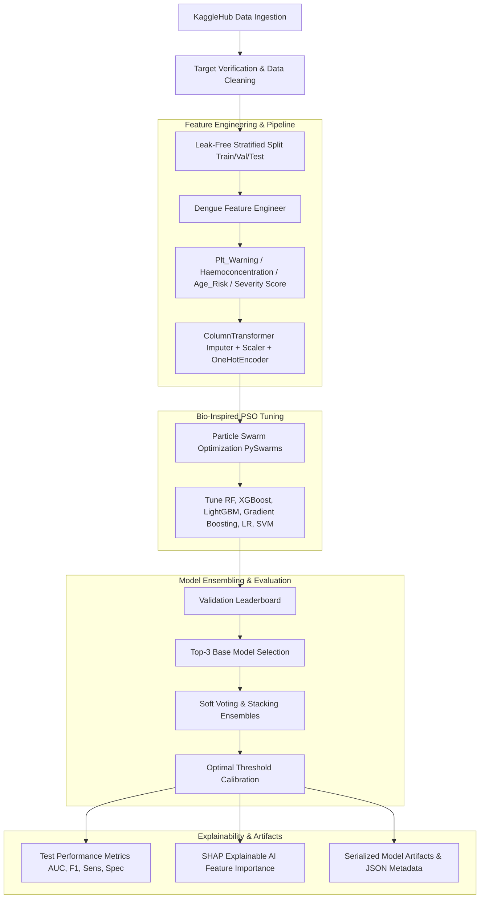

# 🩺 Dengue Severity Prediction Pipeline

[](https://www.python.org/)
[](https://scikit-learn.org/)
[](https://xgboost.readthedocs.io/)
[](https://lightgbm.readthedocs.io/)
[](https://pyswarms.readthedocs.io/)
[](https://shap.readthedocs.io/)
[](https://spark.apache.org/)

An enterprise-grade, end-to-end Machine Learning pipeline designed for early diagnosis and risk stratification of Dengue fever severity. By fusing **Clinical Domain Knowledge**, **Bio-Inspired Particle Swarm Optimization (PSO)**, **Ensemble Stacking**, and **Explainable AI (SHAP)**, this pipeline delivers accurate, actionable, and interpretable clinical predictions.

---

## 🎯 Objectives & Key Goals

The primary objective of this repository is to build an intelligent, reproducible, and leak-free clinical prediction system that:

1. **Automates Clinical Risk Stratification**: Automatically ingests routine physiological and laboratory metrics to accurately predict Dengue diagnosis and severity levels.
2. **Optimizes Hyperparameters via PSO**: Replaces brute-force grid/random search with **Particle Swarm Optimization** (`pyswarms`) to navigate complex, multi-dimensional hyperparameter search spaces efficiently.
3. **Ensures Bio-Medical Interpretability**: Integrates SHAP (SHapley Additive exPlanations) to demystify black-box predictions, empowering clinicians with feature-level explanations for triage decisions.
4. **Prevents Data Leakage**: Implements strict data isolation via stratified validation splits, median/mode robust imputation fitted solely on training data, and custom Scikit-Learn transformers.
5. **Provides Scalable & Reproducible Architecture**: Supports distributed processing via PySpark and Dask for multi-center hospital datasets, serializing all output artifacts and execution metadata.

---

## 🌍 Solving Real-World Clinical Problems

### The Clinical Challenge
Dengue fever is a mosquito-borne viral infection affecting over **400 million people annually** across tropical and subtropical regions. While many cases present as mild fever, a critical subset rapidly escalates to **Severe Dengue** (Dengue Hemorrhagic Fever / Dengue Shock Syndrome), characterized by severe plasma leakage, fluid accumulation, respiratory distress, severe bleeding, and organ impairment.

Key real-world bottlenecks faced by healthcare systems during seasonal outbreaks:
* **Overwhelmed Triage & ICUs**: Emergency departments face sudden patient spikes, making manual risk assessment error-prone.
* **Delayed Identification of Critical Signs**: Early symptoms of severe dengue can mimic mild viral illnesses until rapid vascular collapse occurs.
* **Lack of Specialized Clinical Staff**: Rural and resource-constrained clinics lack experienced epidemiologists and hematologists.

### How This Pipeline Solves It
* **Early Warning System**: Detects hematological abnormalities (e.g., severe thrombocytopenia, haemoconcentration, leukopenia) before critical clinical degradation.
* **Resource Optimization**: Enables healthcare facilities to prioritize high-risk patients for ICU admission while safely managing low-risk individuals in outpatient care.
* **Clinician Trust & Transparency**: Provides visual diagnostic dashboards and SHAP feature importance plots so medical staff can audit prediction drivers (e.g., platelet count dropping below 20,000/μL).

---

## 🏗️ End-to-End System Architecture



---

## 🩺 Clinical Feature Engineering Rules

The pipeline includes a custom Scikit-Learn transformer (`DengueFeatureEngineer`) that dynamically generates clinically relevant diagnostic risk metrics:

| Risk Indicator | Clinical Logic / Threshold | Medical Rationale |
| :--- | :--- | :--- |
| **`Plt_Warning`** | $\text{Platelet Count} < 100,000 / \mu L$ | Mild to moderate thrombocytopenia indicator. |
| **`Plt_Critical`** | $\text{Platelet Count} < 50,000 / \mu L$ | High risk of spontaneous plasma leakage / mucosal bleeding. |
| **`Plt_Danger`** | $\text{Platelet Count} < 20,000 / \mu L$ | Critical hemorrhaging risk requiring immediate blood transfusion. |
| **`Haemoconcentration`** | $\text{Haematocrit} > 45\%$ | Indicates intravascular fluid loss and plasma leakage. |
| **`High_Fever`** | $\text{Temperature} > 38.5^\circ C$ | Febrile phase tracking. |
| **`Leukopenia`** | $\text{WBC} < 4,000 / \mu L$ | Early viral suppression of bone marrow. |
| **`Age_Risk`** | $\text{Age} \le 12 \text{ or } \text{Age} \ge 60$ | Pediatric and geriatric populations with elevated vulnerability. |
| **`Dengue_Severity_Score`** | $\sum \text{Symptom Flags}$ | Composite quantitative clinical risk score. |

---

## 🛠️ Technologies & Libraries Used

### Core Programming & Data Science
* **[Python 3.9+](https://www.python.org/)** — Core language ecosystem.
* **[Pandas](https://pandas.pydata.org/) & [NumPy](https://numpy.org/)** — High-performance numerical compute and tabular data manipulation.
* **[Scikit-Learn](https://scikit-learn.org/)** — ML pipeline composition, preprocessing transformers, metrics, and base estimators.

### Optimization & Machine Learning
* **[PySwarms](https://pyswarms.readthedocs.io/)** — Particle Swarm Optimization (PSO) for swarm-intelligence hyperparameter optimization (`GlobalBestPSO`).
* **[XGBoost](https://xgboost.readthedocs.io/)** — Gradient boosting algorithm tuned for speed and non-linear interactions.
* **[LightGBM](https://lightgbm.readthedocs.io/)** — Fast, memory-efficient gradient boosting framework.
* **[Gradient Boosting, Random Forest, Logistic Regression, SVM]** — Diverse classifier benchmarks.

### Explainability & Distributed Compute
* **[SHAP](https://shap.readthedocs.io/)** — Game-theoretic feature attribution (`TreeExplainer`) for clinical model interpretation.
* **[PySpark](https://spark.apache.org/docs/latest/api/python/) & [Dask](https://dask.org/)** — In-memory distributed computing for large-scale clinical enterprise data.
* **[KaggleHub](https://github.com/Kaggle/kagglehub)** — Automated dataset fetching and synchronization (`dipayancodes/dengue`).

### Visualization & Model Serialization
* **[Matplotlib](https://matplotlib.org/) & [Seaborn](https://seaborn.pydata.org/)** — Publication-quality diagnostic plots, convergence curves, and radar charts.
* **[Joblib](https://joblib.readthedocs.io/)** — Efficient persistence for binary model weights and transformers.

---

## 🐝 Particle Swarm Optimization (PSO) Workflow

Unlike traditional Grid Search or Random Search, **PSO** treats hyperparameter configurations as particles flying through a continuous search space. The swarm updates particle velocities based on individual best positions ($p_{best}$) and global swarm best positions ($g_{best}$):

$$v_i^{t+1} = w \cdot v_i^t + c_1 r_1 (p_{best, i} - x_i^t) + c_2 r_2 (g_{best} - x_i^t)$$

### Swarm Hyperparameter Configuration:
* **Particles**: $15$
* **Iterations**: $20$
* **Inertia Weight ($w$)**: $0.729$
* **Cognitive Coefficient ($c_1$)**: $1.494$
* **Social Coefficient ($c_2$)**: $1.494$

Optimized hyperparameter bounds are automatically mapped for Random Forest, XGBoost, LightGBM, Gradient Boosting, Logistic Regression, and SVM.

---

## 📊 Comprehensive Diagnostic Metrics & Output

The pipeline calculates a complete suite of epidemiological evaluation metrics:

* **AUC-ROC** (Area Under ROC Curve)
* **Sensitivity / Recall** (True Positive Rate for severe cases)
* **Specificity** (True Negative Rate)
* **PPV** (Positive Predictive Value / Precision)
* **NPV** (Negative Predictive Value)
* **F1-Score** (Harmonic Mean of Precision and Recall)
* **Matthews Correlation Coefficient (MCC)** & **Cohen's Kappa**

### Generated Artifacts (`dengue_output/`)

Upon execution, the pipeline automatically writes all diagnostic charts and serialized objects to disk:

```
dengue_output/
├── dengue.csv               # Cached raw Kaggle dataset
├── dengue_best_model.pkl    # Serialized top-performing model pipeline
├── label_encoder.pkl        # Serialized target label encoder
├── metadata.json            # Run metadata & exact hyperparameter parameters
├── validation_results.csv   # Validation leaderboard results
├── pso_convergence.png      # PSO swarm convergence plot per iteration
├── dengue_dashboard.png     # 6-panel comprehensive diagnostic dashboard
├── eda_correlation.png      # Feature correlation matrix
├── eda_distributions.png    # Feature distribution plots
└── eda_target.png           # Target class distribution visualization
```

---

## 🚀 Quickstart & Usage

### 1. Clone the Repository
```bash
git clone https://github.com/Anshuman-1106/Dengue-Severity-Prediction-Pipeline.git
cd Dengue-Severity-Prediction-Pipeline
```

### 2. Set Up Virtual Environment & Install Dependencies
```bash
python -m venv venv
# On Windows:
venv\Scripts\activate
# On Linux/macOS:
source venv/bin/activate

pip install -r requirements.txt
```

### 3. Run the ML Pipeline
```bash
python test_pipeline.py
```

---

## 📜 License & Citation

Distributed under the MIT License. See `LICENSE` for more information.

> **Clinical Disclaimer**: This software pipeline is developed for research and clinical decision support demonstration purposes. It should be validated against local patient populations prior to real-world clinical deployment.
